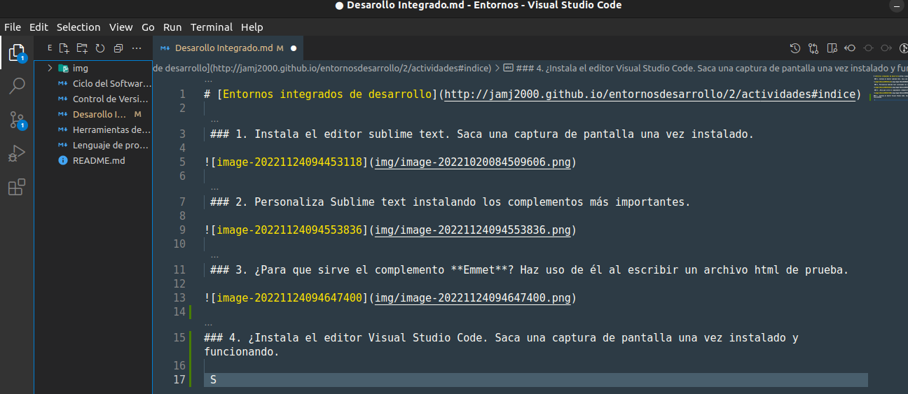

# [Entornos integrados de desarrollo](http://jamj2000.github.io/entornosdesarrollo/2/actividades#indice)

 ### 1. Instala el editor sublime text. Saca una captura de pantalla una vez instalado.


 ### 2. Personaliza Sublime text instalando los complementos más importantes. 


 ### 3. ¿Para que sirve el complemento **Emmet**? Haz uso de él al escribir un archivo html de prueba.


### 4. ¿Instala el editor Visual Studio Code. Saca una captura de pantalla una vez instalado y funcionando.

 

### 5. Haz una comparativa de la funcionalidad ofrecida por Sublime text y la ofrecida por Visual Studio Code referente a los siguientes aspectos:

- Terminal Integrado:
En sublime text, a diferencia de Visual Studio Code, no contiene un terminal integrado, tienes que instlar una extension para usarla

- Emmet Incorporado

- Iconos para los tipos de archivos
En Visual Studio code contiene ya un paquete de iconos, pero puedes descargar otros muchos mas con extensiones

- Atajos de teclas para comentar
Para comentar bloques de codigo en Sublime Text tienes que usar el atajo "Control + 7", sin embargo, esto solo funciona con un teclado inglés, para hacerlo funcionar en otros formatos debes de bindear un tecla usando este codio:
``` 
[
   { "keys": ["ctrl+7"], "command": "toggle_comment", "args": { "block": false } },
   { "keys": ["ctrl+shift+7"], "command": "toggle_comment", "args": { "block": true } }
]
``` 
Para comentar un bloque de codigo con visual code debes selccionar un las lineas deseadas y usar el atajo "Control + k" y seguidamente "Control + U", tambien con "C"ontrol C" lo puedes descomentar
Para Mac exactamente igual pero con la tecla CMD en vez de control

- Atajo de teclas para buscar y seleccionar
Para buscar y seleccionar tanto en Visual Studio Code y Sublime Text tienes que pulsar "Control + F", la funcionalidad es muy similar y ninguno tiene una ventaja frente al otro.